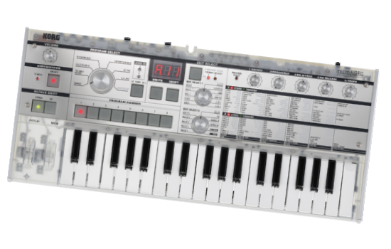
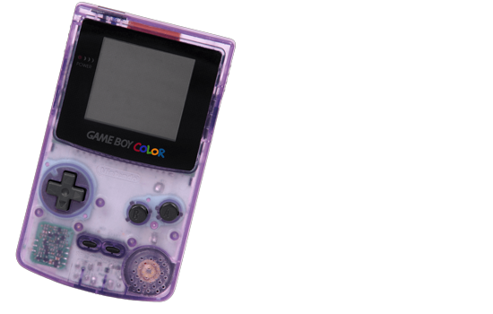

# examen-grupo-01

## Integrantes 

- Benjamín Alonso Álvarez Pavez / [benjaminalvarez21](<https://github.com/disenoUDP/dis8644-2026-1-procesos-2/tree/main/03-benjaminalvarez21>)
- Anays Valentina Cornejo Candia / [Anaysval](<https://github.com/disenoUDP/dis8644-2026-1-procesos-2/tree/main/09-Anaysval>)
- Bruno Ferrari Meyer / [chknngttts](<https://github.com/disenoUDP/dis8644-2026-1-procesos-2/tree/main/11-chknngttts>)
- Lucas Ignacio Ortiz Aguirre / [ryukivol](<https://github.com/disenoUDP/dis8644-2026-1-procesos-2/tree/main/21-ryukivol>)
- Nicolás Elías Valdés Greve / [nicolasvaldesgreve](<https://github.com/disenoUDP/dis8644-2026-1-procesos-2/tree/main/31-nicolasvaldesgreve>)

## Criterios de diseño del sistema 

### ¿De dónde partimos? 

No teníamos conocimiento previo antes de entrar al taller, fue nuestra primera vez trabajando con y soldando componentes electrónicos a placas. Aparte de las clases que dieron los profesores buscamos inspiración en páginas web como foros y canales de YouTube que mostraban como hacer partes de sintetizadores (ej. filtros, amplificadores, reguladores etc..). 

Todo este proceso ha sido prueba y error, si no funciona, se cambia y se vuelve a intentar. Gran parte de la ayuda fue entre compañeros, nos apoyamos para arreglar problemas comunes, compartíamos datos de lugares de compra y páginas web para buscar circuitos interesantes. 

------------

## Referentes 

### WhiteSample

- Artista chileno que usa sintetizadores analógicos

- Ha trabajado con Lollapalooza con estructuras interactivas *(WhiteSample, 2014)* 

- Su música es experimental/electrónica 

> (WhiteSample & Cargo Collective, 2012)

-------------

### anthony1

- DJ/Productor chileno 

- Ha hecho tocatas ambientales donde utiliza sintetizadores analógicos y efectos digitales 

- Forma parte de un colectivo de varios artistas electrónicos chilenos (Team Mekano) 

 

> (Anthony1, 2022)

----------------

## Disponibilidad material 

En cuanto a la disponibilidad material en chile nos ubicamos principalmente en 2 lugares/tienda; San Diego y Victronics. En San Diego se encuentran varias tiendas de electrónicas que ofrecen distintos componentes, la gracia es los distintos lugares y sus especialidades. 

Victronics es una tienda online, por eso pueden ofrecer precios más bajos, además tienen accesorios como espaciadores y pernos para armar las carcasas. 

### BOM PCB MAINCRA

Este módulo te permite interactuar con el sintetizador mediante vibraciones en el piezo, mediante golpes en el mismo. Estas vibraciones serán captadas por el piezo, lo cual lo tomará como señal para avanzar en el secuenciador. 

La idea detrás de esta propuesta nace de la posibilidad de sentir y ver las vibraciones. Aquello que parece caótico o insignificante puede contener señales que, al prestar suficiente atención, adquieren un significado propio. Siguiendo esa lógica, el piezo actúa como un medio para captar esas vibraciones y convertirlas en acciones dentro del sintetizador, permitiendo que elementos normalmente invisibles se vuelvan parte de la interacción. 

| Componente | Cantidad | PCB | Valor unitario | Link | ¿Hay stock en LID? |
| --- | --- | --- | --- | --- | --- |
| Chip NE555P | 1 | U1 | $490 | <https://www.victronics.cl/circuitos-integrados/lm555cngeneralpurposebipolartimerdip8/> | Sí |
| Chip TL072CP | 1 | U4 | $990 | <https://www.victronics.cl/circuitos-integrados/tl072cpdualjfetlowpoweropamplifierdip8/> | No |
| Regulador L7805CV | 1 | U3 | $350 | <https://www.victronics.cl/reguladores/reguladorvoltl7805cv5v-15ato220/> | No |
| Diodo 1N4007 | 1 | D5 | $200 | <https://www.mechatronicstore.cl/diodo-rectificador-in4007-1n4007-4007/> | Sí |
| Diodo 1N5819 | 2 | D6, D7 | $586 | <https://cl.rsdelivers.com/product/nexperia/bat85113/nexperia-diodo-bat85113-diodo-schottky-200-ma-30-v/0300978> | No |
| Transistor 2N2222 | 1 | Q1 | $200 | <https://www.mechatronicstore.cl/transistor-2n2222/> | Sí |
| Potenciómetro B10K | 1 | RV1 | $495 | <https://altronics.cl/potenciometro-lineal-10k-b10k> | No |
| Potenciómetro B500K | 1 | RV2 | $495 | <https://altronics.cl/potenciometro-lineal-500k-b500k?search=b500k> | Sí |
| LED 3mm | 3 | D1, D2, D8 | $100 | <https://www.mechatronicstore.cl/led-3mm-5mm/> | Sí |
| Resistencia 47 Ω | 1 | R12 | $90 | <https://www.electroardu.cl/resistencias-1k-ohm?> | No |
| Resistencia 100 Ω | 1 | R18 |  $90 | <https://www.electroardu.cl/resistencias-1k-ohm?> | Sí |
| Resistencia 220 Ω | 1 | R14 | $90 | <https://www.electroardu.cl/resistencias-1k-ohm?> | Sí |
| Resistencia 1 KΩ | 6 | R1, R3, R6, R7, R8, R11 | $90 | <https://www.electroardu.cl/resistencias-1k-ohm?> | Sí |
| Resistencia 2,2 KΩ | 1 | R13 | $90 | <https://www.electroardu.cl/resistencias-1k-ohm?> | No |
| Resistencia 10 KΩ | 2 | R4, R5 | $90 | <https://www.electroardu.cl/resistencias-1k-ohm?> | Sí |
| Resistencia 100 KΩ | 3 | R2, R16, R17 | $90 | <https://www.electroardu.cl/resistencias-1k-ohm?> | Sí |
| Resistencia 2,2 MΩ | 1 | R15 | $90 | <https://www.electroardu.cl/resistencias-1k-ohm?> | No |
| Condensador cerámico 1 µF | 1 | C9 | $100 | <https://www.mechatronicstore.cl/condensadores-ceramicos-distintos-valores/> | No |
| Condensador cerámico 4.7 nF | 1 | C12 | $100 | <https://www.mechatronicstore.cl/condensadores-ceramicos-distintos-valores/> | No |
| Condensador cerámico 10 nF | 1 | C13 | $100 | <https://www.mechatronicstore.cl/condensadores-ceramicos-distintos-valores/> | No |
| Condensador cerámico 100 nF | 3 | C1, C7, C10 | $100 | <https://www.mechatronicstore.cl/condensadores-ceramicos-distintos-valores/> | Sí |
| Condensador polarizado 10 µF | 2 | C9, C11 | $100 | <https://www.mechatronicstore.cl/condensador-capacitorio-de-electrolitico-por-unidad-varios-valores/> | Sí |
| Condensador polarizado 100 µF | 3 | C2, C3, C5 | $100 | <https://www.mechatronicstore.cl/condensador-capacitorio-de-electrolitico-por-unidad-varios-valores/> | Sí |
| Piezo | 1 | J8 | $990 | <https://www.mechatronicstore.cl/sensor-piezoelectrico-27mm-con-cable/> | Sí |
| Cables dupont 40 uni. | 1 | - | $2.990 | <https://mcielectronics.cl/shop/product/cable-dupont-macho-macho-20cm-pack-40-unidades-2/> | Sí |
| Batería 9V recargable | 1 | BT1 | $7.990 | <https://www.sodimac.cl/sodimac-cl/articulo/110251085/bateria-recargable-9v/110251089> | Sí |
| Interruptor Switch | 1 | SW3 | $570 | <https://www.katode.cl/switches/1339-interruptor-switch-2-pines-on-off-corto.html?> | No |

### BOM PCB 02, GRUPO 02: REGISTRO DE DESPLAZAMIENTO ESTÁTICO / NYAN CAT

Este circuito también se categoriza como un secuenciador, es decir, que genera corrientes eléctricas en un patrón repetitivo y ordenado.

El cerebro detrás de este chip, realmente son 2, los que se comunican entre ellos para poder generar un efecto ola o cascada.

| Componente | Cantidad | PCB | Valor unitario | Link | ¿Hay stock en LID? |
| --- | --- | --- | --- | --- | --- |
| Chip 4015 | 1 | U2 | $1.400 | <https://www.mactronica.com.co/cd4015?> | No |
| Regulador L7805CV | 1 | U4 | $350 | <https://www.victronics.cl/reguladores/reguladorvoltl7805cv5v-15ato220/> | No |
| Transistor 2N2222 | 8 | Q3, Q4, Q5, Q6, Q7, Q8, Q9, Q10 | $220 | <https://www.cabezacuadrada.cl/product/pn2222a/> | Sí |
| Transistor BC548 | 1 | Q1 | $200 | <https://www.mechatronicstore.cl/transistor-bc548/?> | No |
| LED 3mm | 9 | D1, D2, D3, D4, D5, D6, D7, D8, D12 | $100 | <https://www.mechatronicstore.cl/led-3mm-5mm/> | Sí |
| Resistencia 220 Ω | 8| R4, R5, R6, R7, R8, R9, R10, R11 | $90 | <https://www.electroardu.cl/resistencias-1k-ohm?> | Sí |
| Resistencia 1 KΩ | 18 | R3, R12, R15, R16, R17, R18, R19, R20, R21, R22, R23, R24, R25, R26, R27, R28, R29, R30 | $90 | <https://www.electroardu.cl/resistencias-1k-ohm?> | Sí |
| Resistencia 10 KΩ | 1 | R2 | $90 | <https://www.electroardu.cl/resistencias-1k-ohm?> | Sí |
| Resistencia 100 KΩ | 1 | R13 | $90 | <https://www.electroardu.cl/resistencias-1k-ohm?> | Sí |
| Diodo 1N4007 | 1 | D11 | $200 | <https://www.mechatronicstore.cl/diodo-rectificador-in4007-1n4007-4007/> | Sí |
| Condensador cerámico 100 nF | 1 | C9 | $100 | <https://www.mechatronicstore.cl/condensadores-ceramicos-distintos-valores/> | Sí |
| Condensador polarizado 10 µF | 1 | C8 | $100 | <https://www.mechatronicstore.cl/condensador-capacitorio-de-electrolitico-por-unidad-varios-valores/> | Sí |
| Condensador polarizado 100 µF | 1 | C7 | $100 | <https://www.mechatronicstore.cl/condensador-capacitorio-de-electrolitico-por-unidad-varios-valores/> | Sí |
| Interruptor Switch | 1 | SW4 | $570 | <https://www.katode.cl/switches/1339-interruptor-switch-2-pines-on-off-corto.html?> | No |

### BOM PCB 03, GRUPO 03: COMANDO ESTELAR

Un voltaje entra al chip CD4046, el centro del circuito, que convierte una corriente en una oscilación cuya velocidad varía según el voltaje que le llega. Esa señal pasa luego por dos inversores en el CD40106 que la limpian y estabilizan, hasta llegar al conector de audio jack (el output del módulo). Terminamos con una señal oscilante limpia y lista para ser procesada por los demás módulos del sintetizador.

| Componente | Cantidad | PCB | Valor unitario | Link | ¿Hay stock en LID? |
| --- | --- | --- | --- | --- | --- |
| Chip CD4046 | 1 | U1 | $700 | <https://electronicareal.cl/producto/integrado-digital-cmos-4046/> | No |
| Chip CD40106 | 1 | U4 | $1200 | <https://electronicareal.cl/producto/integrado-digital-cd-40106/> | No |
| L7805 | 1 | U2 | $350 | <https://www.victronics.cl/reguladores/reguladorvoltl7805cv5v-15ato220/> | Sí |
| Diodo 1N4007 | 1 | D1 | $790 | <https://www.victronics.cl/diodos/diodo-rectif-1n4007-1000v-1a-vfd-1-1v-50u/> | Sí |
| LED | 1 | D2 | $300 | <https://electronicareal.cl/producto/led-difuso-blanco-10mm/> | Sí |
| Resistencia 100kΩ | 1 | R1 | $890 | <https://electronicareal.cl/producto/resistencia-1-4-w-100-k-ohm/> | Sí |
| Resistencia 1kΩ | 1 | R2 | $890 | <https://electronicareal.cl/producto/resistencia-1-4-w-1-k-ohm/> | Sí |
| Potenciómetro 100Ω | 2 | RV1, RV2 | $500 | Afel a Ingeniería | Sí |
| Capacitor 10nF | 1 | C1 | $520 | <https://www.victronics.cl/condensadores/condensador-mlcc-10nf-0-01uf-50v-x7r-10-p0-2-10u/> | No |
| Capacitor 100nF | 1 | C5 | $500 | <https://www.victronics.cl/condensadores/condensador-mlcc-0-1uf-50v-x7r-10-p0-1-10u/> | Sí |
| Capacitor 100uF | 2 | C2, C6 | $670 | <ttps://www.victronics.cl/condensadores/cond-electrolitico-100uf-50v20-105oc-812-p4mm-10u/> | Sí |
| Capacitor 10uF | 2 | C3, C4  | $330 | <https://www.victronics.cl/condensadores/condensadorelectrolitico10uf50v/> | Sí |
| Capacitor 1uF | 1 | ?? | $300 | <https://www.victronics.cl/condensadores/cond-electrolitico-1uf-50v-20-105oc-511-p2-5mm-10u/> | Sí |
| Jack DC | 2 | J2, J3 | $150 | Electrónica Real | Sí |
| Jack de audio | 1 | J1 | $150-$300 | Victronics | Sí |

### Carcasas

| Componente | Cantidad | Valor unitario | Link/Lugar | ¿Hay stock en LID? |
|----------|-----------|--------|-------------|-------------|
| Interruptor de palanca SPST ON-OFF | 5 | $590 | Electrónica Hobby (Página en remodelado) | No |
| Separador (M3*30mm) | 52 | $1490 x 4 | <https://www.victronics.cl/hardware/separador-niquelado-m330mm-4u/> | No |
| Tuerca (M3) | 20 | $1190 | Pernos alameda | No |
| Golilla (M3) | 40 | $400 | <https://www.victronics.cl/hardware/k3-d218-golilla-m3-ranurada-inox-a2-50u/> | No |

### Tiempos trabajo

| Proceso | Integrantes | Duración | Total equipo |
|----------|-----------|--------|-------------|
| Procesos y solución de errores | 5 | 3 semanas | 240h |

| Proceso | Integrantes | Duración | Total equipo |
|----------|-----------|--------|-------------|
| Soldadura | 5 | 3 semanas | 54h |

----------------

# **?????????** *(Placas soldadas)*

Nuestro sintetizador está formado de 4 módulos: 

## Maincra (Piezo/Entrada) 

*Un micrófono de contacto que detecta vibraciones, manda señales a un amplificador e inversor de señales. Estos convierten la corriente la cual entra a un reloj interno que lo camba a pasos para que un secuenciador pueda funcionar.*

(foto)

## Nyan cat (Secuenciador) 

*Un secuenciador de 8 pasos (y dos fases) que permite la conexión de múltiples osciladores.*

(foto)

## Comando estelar (Oscilador) 

*Esta placa utiliza 2 chip para general oscilaciones que alteran a través de potenciómetros que permiten cambiar tanto la frecuencia como la modulación del sonido.*

(foto)

## Parla (Amplificador/Salida) 

*Es un amplificador de señal que permite escuchar las oscilaciones del módulo anterior con mayor volumen.*

(foto)

-------------

## Procesos 

 ㅤㅤㅤㅤㅤㅤ 

### Para tener un flujo de trabajo más ordenado pusimos todos los componentes necesarios para armar una placa de lado. 

**1era dificultad:**

- Tuvimos problemas con la organización en la compra de componentes, listas incompletas.

### Soldamos los componentes por tamaño (de más pequeño a más grande) y cables para los que van montados en la carcasa. 

**2da dificultad:**

- También tuvimos problemas con el corte del acrílico para la carcasa.

  - **1er corte:** Falta de agujeros para componentes y tamaño equivocado.

  - **2do corte:** Formato no compatible de archivo.

  - **3er/4to/5to corte:** Parámetros erróneos y líneas de corte extra.

  - **6to corte:** Por falta de material usamos los restantes de cortes anteriores.

### Armamos las carcasas con los separadores.

**3era dificultad:**

- Falta de separadores para las carcasas por modificaciones en tamaño.

### Se empezó a armar la cubierta de acrílico con los separadores *(gracias al grupo 04 por darnos sus separadores restantes)*. 

### Pusimos los potenciómetros, entradas/salidas de audio y switch conectados con los cables.

**4ta dificultad:**

- Funcionamiento correcto de las PCB, soldamos varias veces las placas, cambiamos los componentes y remplazamos los cables, pero no funcionaban. 

----------------

## Carcasa 

> Escogimos trabajar con acrílico ya que éramos familiares con el material. es fácil de trabajar por su compatibilidad con el corte láser que nos permitía cortar varias carcasas, grabar y lograr un buen oficio. El material es firme, perfecto para lo que teníamos en mente, además es económico.
>
> Una cualidad del acrílico que utilizamos es la transparencia. Buscamos celebrar el diseño de las PCB a través de la transparencia de este, rompiendo la caja negra e invitando a la apreciación integral de cada placa y sus distintos componentes.

### Referentes carcasa 

*Para la carcasa usamos estos 3 ejemplos:*

> ### **CMF Phone - Nothing (Nothing, 2024)**
>
> Este dispositivo también utiliza módulos al igual que nuestro sistema.
>
> 
>
> ### **microKorg Crystal - Korg (KORG, 2022)**
>
> Siendo un sintetizador nos llamó la atención que también use carcasa transparente.
>
> 
>
> ### **Gameboy transparente - Nintendo (Amo, 2011)**
>
> Al igual que el microKorg Crystal, utiliza una carcasa transparente, permitiendo observar el interior.
>
> 
>
> *Utilizamos estos referentes como inspiración para llegar al resultado de las placas, combinando las características que se reflejan en nuestros conceptos.*
> 

## Composición 

### Referentes

- **Yoko Ono:**

> ### **"PIEZA DE ESCONDITE"**
>
> *"Esconderse hasta que todos se vayan a sus casas."*
>
> *"Esconderse hasta que todos se olviden de uno."*
>
> *"Esconderse hasta que todos se mueran."*
> *(Ono, 1964, 25)*

---

#### Integración a la vida diaria

Al hacer brainstorming de que podríamos hacer como partitura nos dimos cuenta de que nuestras ideas eran actividades que independientes de nuestra partitura se llevan a cabo. Nosotros nos introducimos a esta creando una composición nueva cada vez que se toca. 

Descubrimos que nuestra partitura calzaba con el principio del Sitio especifico, un tipo de obra especifica planeada para un lugar concreto. En nuestro caso siendo la mesa de Ping Pong en la FAAD. (Kolodynski, n.d.) 

---

### Ping Pong

*(ver. literal 2)* **Como grupo-01 vamos a ir a República 180, Santiago de Chile con “Maincra” (piezo-01), el parlante, “Nyan cat” (secuenciador-2) y "comando estelar" (oscilador-1). Pedir las paletas y pelotas donde los guardias. Pondremos un piezo en cada paleta de Ping Pong con masking tape. Situar el sintetizador bajo la mesa, asegurar que los cables no se enreden entre sí. Jugar una partida completa de Ping Pong de 21 puntos, con el impacto de la pelota en las paletas el secuenciador avanza, haciendo que el oscilador pueda funcionar. Al terminar la partida devolver las paletas y pelota a los guardias.**

*(ver. poética)*

>**Ve a República 180 y ubica el piezo en la mesa de ping pong**
>
>**Invita a alguien a jugar**
>
>**Jueguen durante 5 minutos o hasta que se aburran**

------------------

## Bibliografía

Amo, E. (2011, 02 10). Game Boy Color [A Game Boy Color, shown in clear atomic purple color.]. WikiPedia. <https://upload.wikimedia.org/wikipedia/commons/f/f9/Game-Boy-Color-Purple.jpg?uselang=es>

Anthony1. (2022, 05 12). (ノ^_^)ノƪ(‾.‾“)┐(ノ^_^)ノƪ(‾.‾“)┐. Santiago, Chile. <https://www.instagram.com/anthony1.one/p/CdfBOJiutpF/>

Kolodynski, M. (n.d.). Site-specific | IDIS. Proyecto Idis. <https://proyectoidis.org/site-specific/>

KORG. (2022). microKORG Crystal. KORG. <https://www.korg.com/cl/products/synthesizers/microkorg_crystal/>

Nothing. (2024). CMF Phone 1. NOTHING. <https://cl.nothing.tech/products/cmf-phone-1?Colour=Black&Capacity=8%2B128GB>

Ono, Y. (1964). Pomelo: Un libro de instrucciones de Yoko Ono. <https://monoskop.org/images/8/83/Ono_Yoko_Pomelo_Un_libro_de_instrucciones_de_Yoko_Ono.pdf>

WhiteSample. (2014). SpeakerSampler. SpeakerSampler. <https://cargocollective.com/whitesample/SpeakerSampler>

WhiteSample, & Cargo Collective. (2012, 01 04). Live at Mutek_CL. <https://vimeo.com/34586254?fl=pl&fe=ti>

-----------------

## preguntas domingo

placas usadas:

- placa 01: piezo 01, diseñada por grupo 01
- placa 02: secuenciador 02, diseñada por grupo 02
- placa 03: oscilador 01, diseñada por grupo 03

explicación de flujo de señal de audio:

ordenado a grandes rasgos gesto humano a fuentes de tiempo, a secuenciador, a osciladores, a filtros, a mezcladores, a parlante

- la placa 01 es el piezo, tiene como entrada un golpecito en el piezo, y la salida es un pequeño voltaje que va conectado a la placa 02 secuenciador.
- la placa 02 tiene como entrada la señal de control del piezo, estamos viendo como arreglaralo ya que la primera vez no funcionó. estamos soldando uno nuevo para ver si fue un error de soldadura con nuevos componentes. de las 8 entradas usamos 4, el 4to siendo reset para comenzar el ciclo de nuevo. (soldamos el pin 2 y 14 como una forma de hechizo)
- cada placa 03 de osciladores es una fuente sonora, tenemos 3 montados juntos en una carcasa. tuvimos un problema con la placa del medio, nunca sonaba correctamente. soldamos uno ultimo y nos dimos cuenta que usamos un chip erroneo y una cama estaba mal puesta.

estado de construcción:
- placa 01: no funciona, la entrada original del piezo no es funcional, si uno se conecta al otro audiojack se prenden LEDs. los potenciometros controlan la intensidad de la luz y bloquean al piezo.
- placa 02: notamos que ambos pines de RST están unidos GND y consecuentemente a todas las salidas/entradas de la placa. sospechamos que esto es lo que hace que la placa no funcione correctamente. como solución tenemos usar una easy PCB. queremos soldar un circuito común usando el 4017.
- placa 03: funcionan algunos, los de los costados suenan correctamente, el del medio tiene más problemas. nos dimos cuenta que pusimos mal una cama/zapato y que usamos un chip distinto al resto. ahora estamos soldando los componentes nuevamente con el chip correcto.

ayudas eléctricas que necesitamos domingo:

- placa 01: queremos ayuda viendo las conexiónes del piezo. ver como hacerlo funcionar correctamente.
- placa 02: vamos a preguntar a compañeros primero y si no ver temas de LEDs y confirmar buen funcionamiento
- placa 03: ver tema placa del medio. 

ayuda audio que necesitamos domingo:

- ver conexión placas entrada/salida. ver como conectar todos los osciladores a un parla

materiales faltantes:

- chips 4046/40106 para Comando estelar (para tener a mano por si algo se quemara)

- El chip 386 permite amplificar y segun lo que entendo estoy buscando estrategias de como mutear y dicen que la patiata 7 sirve para eso si le ponenun switch y patita 7 a tierra = se mute, no es p¿erfecto pq se escucha unpopo perp se mutea, malan con mati 386 entra osciladores y piezo que contrpole esa patita de mutear  

 -------

Como mutear 386? 

 

https://hackaday.com/2016/12/07/you-can-have-my-lm386s-when-you-pry-them-from-my-cold-dead-hands/ 

 

MISAAAAAAA AYUDA tengo una idea! Eureka! Pin 7 en GND = mute allegedly. Si hacemos que el piezo se conecte a VCC y GND. funciona “mal” y la señal choca con GND sino me equivoco. Si conectamos en piezo así y logramos invertir la señal, podria ser: golpe = sonido/vcc - no golpe = mute/GND 
